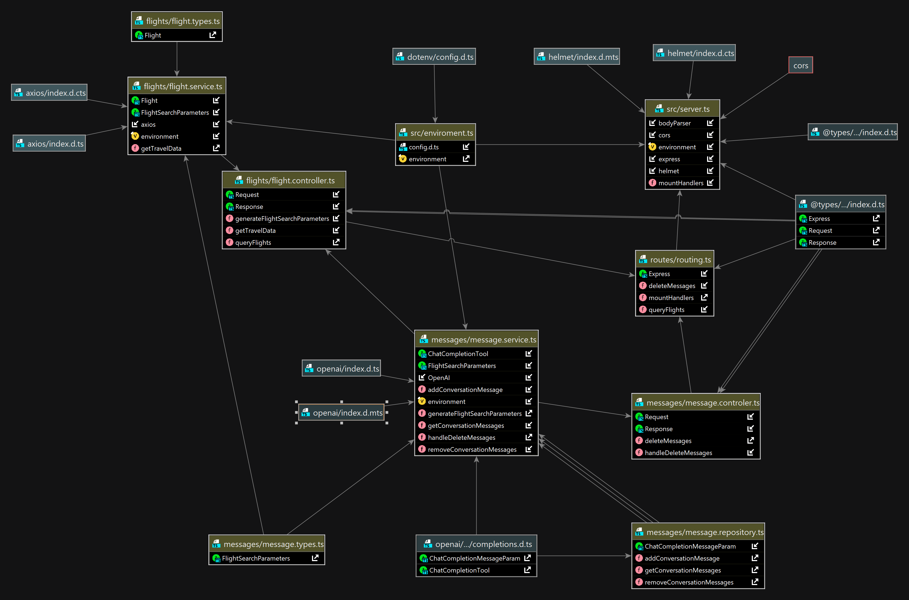

# Travel-planner API

made by interim Tristan Huygen

## Table of Contents

- [Introduction](#introduction)
- [Used technologies](#used-technologies)
- [Installation](#installation)
- [Usage](#usage)
- [Testing](#testing)
- [Example](#Example)

## Introduction

The Travel-planner API is part of the internship project made
by [Tristan Huygen](https://www.linkedin.com/in/tristan-huygen-57786b2b0/)
and [Axell Tielemans](https://www.linkedin.com/in/axell-tielemans/). In this project they make use of
the [openAi API](https://platform.openai.com/docs) to
transform user input into a json object to filter in
the [Tequila travel API from Kiwi](https://tequila.kiwi.com/portal/companies/hikeheaven).



## Used technologies
- Node.js
- Express
- Jest
- Nock
- Axios
- OpenAi API
- Tequila API

## Installation
````shell
# download the project or clone it from github
git clone https://github.com/jstack-be/jstack--flight-app.git

#install the dependencies
npm install
````

## Usage
Create a `.env` file in the root of your project and add the required environmental variabels:
````dotenv
FLIGHT_API_KEY="your-api-key-from-tequila"
OPENAI_API_KEY="your-api-key-from-openai"
OPENAI_ORGANISATION_KEY="your-organisation-key-from-openai"

#The following enviromental variabels can be changed but should always be included
SERVER_PORT=3000
FLIGHT_SEARCH_URL="https://api.tequila.kiwi.com/v2/search"
````

Start in development mode
````shell
npm run dev
````
Start in production mode
````shell
npm run start
````

## Testing
Run tests
````shell
npm run test
````

## Examples

Get the flight data
```shell
curl -X POST http://localhost:3000/api/flights \
  -H 'Content-Type: application/json' \
  -d '{
    "messages": ["I want to travel with my wife and two children from London to Antwerp on 18/05/2024 and I am planning to return on 16/06/2024"]
}'
```